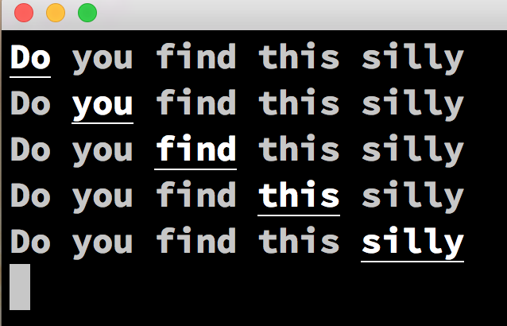

# Book - Programmer Guilde To Ncurses


## Programmer Guilde To Ncurses in Ruby

[Write Programmer Guilde To Ncurses](http://www.amazon.com/Programmers-Guide-NCurses-Dan-Gookin/dp/0470107596) has good examples written in C lang.

Ruby [curses library](http://ruby-doc.org/stdlib-2.0.0/libdoc/curses/rdoc/Curses.html) is not only easy to use and sample but also gives same output.

## Expected Output of Execution   
Ruby & C code will produce same output




## Ncurses in C
```c
// annoy.c

#include <ncurses.h>

#define COUNT 5

int main(void) {
  char text[COUNT][10] = { “Do”, “you”, “find”, “this”, “silly?” };
  int a,b;

  initscr();

  for(a=0;a<COUNT;a++)
  {
    for(b=0;b<COUNT;b++)
    {
      if(b==a) attrset(A_BOLD | A_UNDERLINE);
      printw(“%s”,text[b]);
      if(b==a) attroff(A_BOLD | A_UNDERLINE);
      addch(‘ ‘);
    }
    addstr(“\b\n”);
  }
  refresh();
  getch();

  endwin();
  return 0;
}
```

## Ncurses in Ruby
```ruby
#!/usr/bin/env ruby
# annoy.rb

require 'curses'

include Curses

init_screen
strs = %w(Do you find this silly)

strs.each_with_index do | s, i |
  strs.each_with_index do | t, j |
    attrset(A_BOLD | A_UNDERLINE) if i == j
    addstr t
    attroff(A_BOLD | A_UNDERLINE) if i == j
    addch ' '
  end
  addstr "\b\n"
end

refresh

getch

close_screen
```

